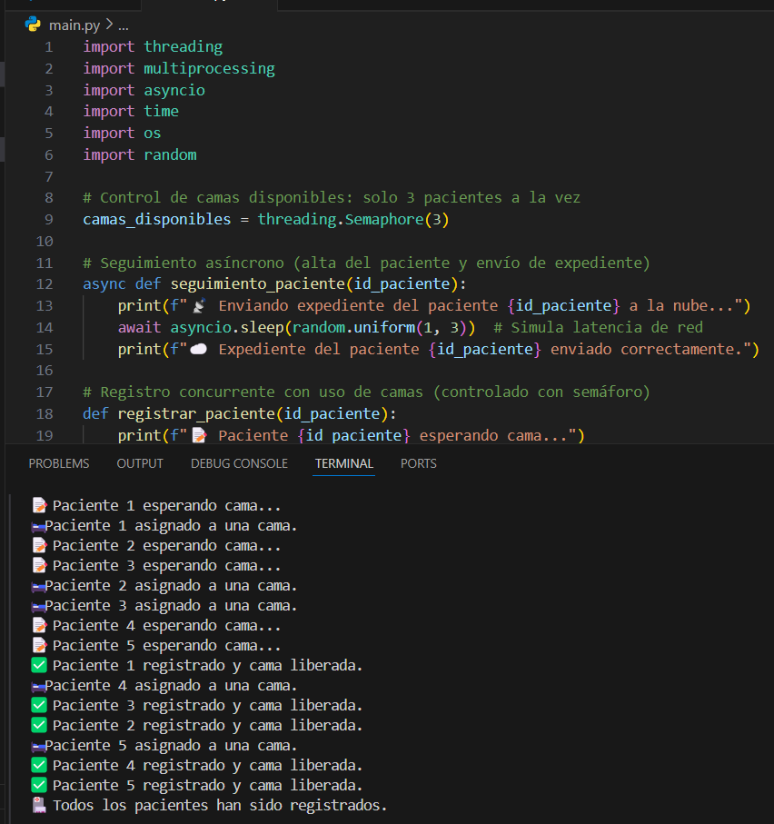
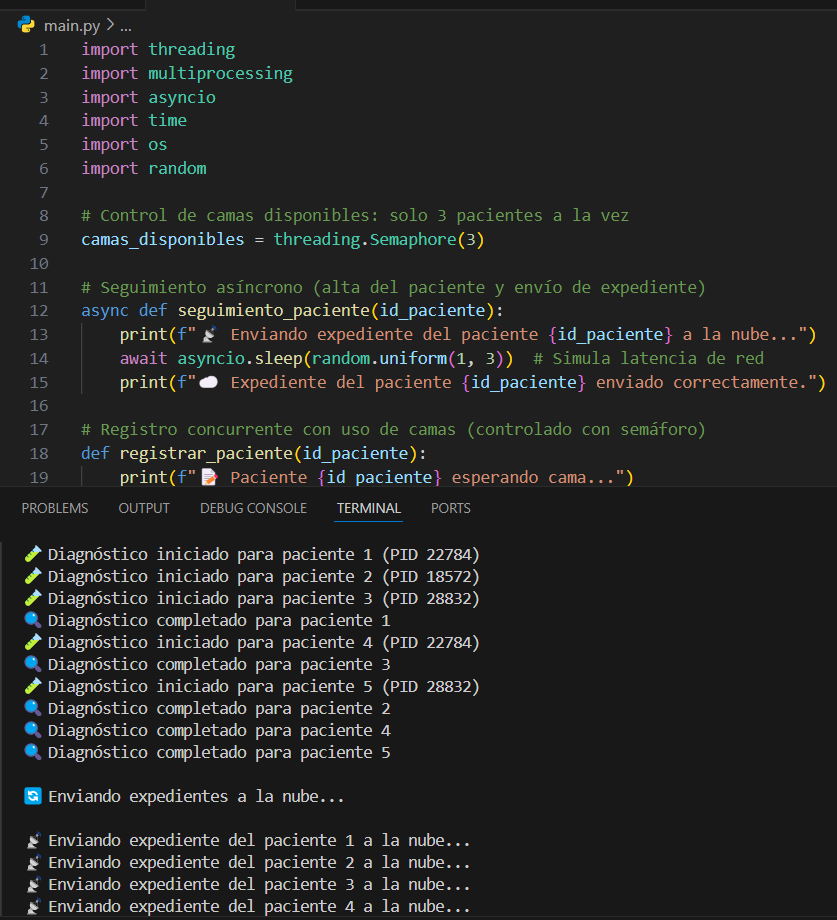

# 🏥 Simulación Hospitalaria con Paradigmas de Programación

Este proyecto simula el flujo de pacientes en un hospital, aplicando **tres paradigmas de programación distribuidos**.

---

## 💡 Descripción General

Se modela la atención de urgencias de forma realista usando:

- **Concurrencia (threading)** para el registro de pacientes simultáneos.
- **Control de recursos (semaphore)** para limitar el acceso a camas disponibles.
- **Paralelismo (multiprocessing)** para el diagnóstico intensivo de CPU.
- **Asincronía (asyncio)** para el seguimiento simulado de pacientes vía API.

---

## ⚙️ Tecnologías utilizadas

- Python 3.12+
- `threading`
- `asyncio`
- `multiprocessing`
- `random`, `time`, `os`

---

## 🧠 Paradigmas implementados

| Paradigma       | Técnica Usada             | Aplicación                           |
|-----------------|---------------------------|--------------------------------------|
| Concurrencia    | `threading.Thread`        | Registro de pacientes simultáneos    |
| Control recursos| `threading.Semaphore(3)`  | Límite de camas disponibles          |
| Paralelismo     | `multiprocessing.Pool(3)` | Diagnóstico intensivo (tipo IA)      |
| Asincronía      | `async def`, `await`      | Seguimiento vía API simulada         |

---

## 🖼️ Diagrama del sistema

📎 [`Diagrama de flujo del Hospital.pdf`](./_Diagrama%20de%20flujo%20del%20Hospital.pdf)

---

## 📸 Capturas de ejecución

### Registro concurrente

### Diagnóstico paralelo y seguimiento
  

---

## 📁 Archivos del Proyecto

- 📜 [`main.py`](./main.py) — Código fuente principal
- 🧾 [`Practica 1 421040001.pdf`](./Practica%201%20421040001.pdf) — Reporte completo
- 🗺️ [`Diagrama de flujo del Hospital.pdf`](./_Diagrama%20de%20flujo%20del%20Hospital.pdf)

---

## ✅ Uso ético de IA

Durante la realización de esta práctica se utilizó inteligencia artificial (ChatGPT) como herramienta de asistencia para:

- Diseño inicial del sistema
- Resolución de errores
- Aplicación de paradigmas
- Verificación de requisitos

El uso fue supervisado y documentado de forma responsable, sin sustituir el proceso de aprendizaje.

---

## ✨ Conclusión

El ejercicio permitió aplicar los tres principales paradigmas de programación distribuidos en un caso realista. A través de la simulación, se comprendieron sus ventajas, interacciones y dificultades prácticas.
